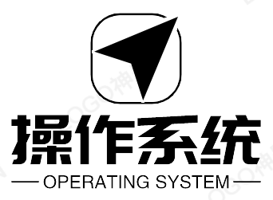
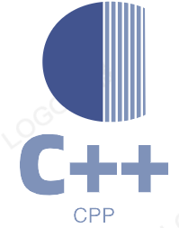

| &nbsp;算法| 操作系统 |计算机网络&nbsp;|分布式| &nbsp;&nbsp;数据库&nbsp;&nbsp;|&nbsp;&nbsp;&nbsp;C++&nbsp;&nbsp;&nbsp;|Hadoop| &nbsp;&nbsp;&nbsp;Spark&nbsp;&nbsp;&nbsp; |后端| &nbsp;&nbsp;数仓&nbsp;&nbsp;&nbsp; |
| :---: | :----: | :---: | :----: | :----: | :----: | :----: | :----: | :----: | :----: |
|  |  |  |  |  ||  ||  ||

 

    

 

##  面试算法
### 书籍
- 《剑指offer》
- 《挑战程序设计竞赛》
- 《算法4》
-  [百度网盘下载](https://pan.baidu.com/s/1dMX16TRVioac_eujupN2uA) 提取码：xenx

### 在线学习
- [剑指offer在线](https://www.nowcoder.com/ta/coding-interviews)
- [leetcode](http://leetcode-cn.com/)
- [labuladong的算法小抄，很强](https://github.com/shujuner/fucking-algorithm)

### 面试高频题：分门别类
- [动态规划](alg/dp.md)
- [数组](alg/array.md)
- [二叉树](alg/BinaryTree.md)
- [栈](alg/stack.md)
- [堆](alg/heap.md)
- [链表](alg/list.md)
- [贪心](alg/greedy.md)
- [字符串](alg/string.md)
- [二分查找](alg/binarySearch.md)
- [回溯](alg/backTrack.md)
- [数学相关](alg/math.md)
- [C++库函数](alg/Cpp.md)
- [常见数据结构](alg/dataStructure.md)
- [排序算法](alg/sort.md)
##  C++

### 书籍
- C++ Primer
- C和C++程序员面试宝典
- 深度探索C++对象模型
- Effective C++
- Effective STL
- [百度网盘下载](https://pan.baidu.com/s/1m73uX6OAXXpLBUnKuPdNDQ) 提取码:70bv

### 在线基础学习
- [Source 1](https://github.com/shujuner/interview)
- [Source 2:牛客网](https://www.nowcoder.com/tutorial/93/a34ed23d58b84da3a707c70371f59c21)

### 高频面经
- [点这里](CPP/cpp.md)

##  操作系统

### 书籍
- 鸟哥的私房菜
- 计算机操作系统概论
- [百度网盘](https://pan.baidu.com/s/16dd0OVok5MEV-Hox9Hh9AQ) 提取码:h1jx

### 高频面经
- [在这里](operationSystem/operationSystem.md)

##  计算机网络

### 书籍
- 图解Http
- 自顶向下
- TCP-IP详解
- 图解TCP/IP
- [百度网盘](https://pan.baidu.com/s/18RdJy-c7bPuYBO04Q6h4Ug) 提取码:tf7v

### 高频面经
- [在这里](network/network.md)

##  分布式系统理论

-[高频面经]()

##  数据库

### 书籍
- MySQL技术内幕(Innodb)
- 高性能MySQL
- Redies设计与实现
- Leveldb-Handbooks
- [百度网盘](https://pan.baidu.com/s/1286c4K4dpECCS1B8onw0zw) 提取码:u6tg

### 高频面经
- [MySQL](db/mysql.md)
- [Redies](db/redies.md)
- [LevelDB](leveldb.md)

##  Hadoop

###高频面经
- [MapReduce](hadoop/MapReduce.md)
- [Yarn](hadoop/Yarn.md)
- [HDFS](hadoop/HDFS.md)

##  Spark

### 书籍
- SparkInternals
- Spark SQL内核解析
- 深入理解Spark核心思想与源码解析
- [百度网盘](https://pan.baidu.com/s/1vWOQE2InOLquk3hSDBj7wg) 提取码:gbcv

### 高频面经
- [Hbase](Spark/hbase.md)
- [Hive](Spark/hive.md)
- [Spark SQL](Spark/sql.md)
- [Kafka](Spark/kafka.md)
- [Zookeeper](Spark/zookeeper.md)
- [Spark](Spark/spark.md)

##  服务端

### 书籍
- Linux高性能服务器编程
- Linux多线程
- Linux 多线程服务端编程 使用 muduo C++ 网络库
- [百度网盘](https://pan.baidu.com/s/1fjtNVfjSrRTRZdsZpSsQ5Q) 提取码:5o6q

### 高频面经
- [这里]()

##  数据仓库

### 书籍
- 数据仓库原理与实践
- [百度网盘](https://pan.baidu.com/s/1BNeT-JBIqIQp9F8hqcDenA) 提取码:ad3v

### 高频面经
- [重要知识点]()

### 致谢

